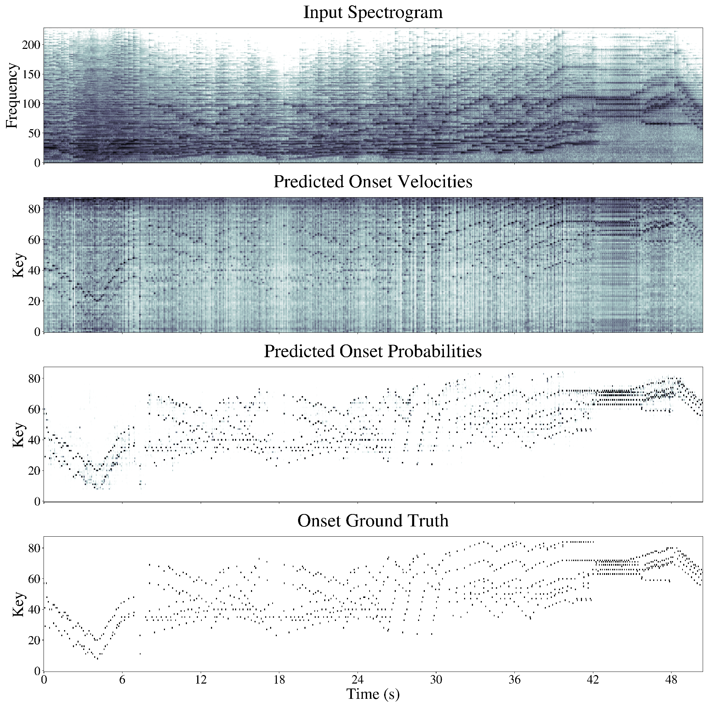

# iamusica_training


<p align="center">

</p>

The present repository hosts the software needed to train and evaluate the Deep Learning piano onset+velocity detection model presented in our paper: Onsets and Velocities: Affordable Real-Time Piano Transcription Using Convolutional Neural Networks*. Specifically, it provides the means to:
* Install the required software dependencies
* Download and preprocess the required dataset
* Run and evaluate (pre)trained models
* Train models from scratch

See [this companion repository](https://github.com/andres-fr/iamusica_demo) for a real-time, graphical software demonstration.

 

*O&V was developed in the context of the [IAMúsica](https://joantrave.net/en/iamusica/) project, supported by research grant [389062, INV-23/2021](http://www.iebalearics.org/media/files/2022/02/10/resolucio-definitiva-inv-boib-2021-cat.pdf) from the [Institut d'Estudis Baleàrics](http://www.iebalearics.org/ca/), and composed by:*
* [Eulàlia Febrer Coll](https://www.researchgate.net/profile/Eulalia-Febrer-Coll)
* [Joan Lluís Travé Pla](https://joantrave.net/en)
* [Andrés Fernández Rodríguez](https://aferro.dynu.net)

This is [Free/Libre and Open Source Software](https://www.gnu.org/philosophy/floss-and-foss.en.html), see the [LICENSE](LICENSE) for more details. If you use this work, please consider citing the paper:

```
@article{onsvel,
    title   = "{Onsets and Velocities}: Affordable Real-Time Piano Transcription Using Convolutional Neural Networks"
    author  = "Andres Fernandez",
    year    = "2023",
}
```


---

# Software dependencies

We use `PyTorch`. The following instructions should allow to create a working environment from scratch, with all required dependencies (tested on `Ubuntu 20.04` with `conda 4.13.0`):

```
# create and activate conda venv
conda create -n onsvel python==3.9
conda activate onsvel

# conda dependencies
conda install pytorch==1.11.0 torchaudio==0.11.0 -c pytorch
conda install pandas==1.4.2 -c anaconda
conda install omegaconf==2.1.2 -c conda-forge
conda install h5py==3.6.0 -c anaconda


# pip dependencies
pip install coloredlogs==15.0.1
pip install mido==1.2.10
pip install mir-eval==0.7
pip install parse==1.19.0

# optional
conda install matplotlib==3.7.1 -c conda-forge
```

See the full [requirements](assets/requirements.txt) for a comprehensive description of the resulting environment.


---

# Data downloading

For this project, training and evaluation is done using the [MAESTRO](https://magenta.tensorflow.org/datasets/maestro) dataset. Specifically, we focus on the latest version, `MAESTROv3`. The full dataset can be readily downloaded at the provided link, and the file structure is expected to end up looking like this:

```
MAESTROv3 ROOT PATH
├── LICENSE
├── maestro-v3.0.0.csv
├── maestro-v3.0.0.json
├── README
├── 2004
├── 2006
├── 2008
├── 2009
├── 2011
├── 2013
├── 2014
├── 2015
├── 2017
└── 2018
```

Where each of the `20xx` directories contains `wav` files with their corresponding `midi` annotations, making a total of 2552 files.

### Downloading other supported datasets:

To ensure compatibility with prior literature, this repository also provides functionality for `MAESTROv1` and `MAESTROv2` (the procedure for those is analogous to v3).

Furthermore, it also provides all functionality needed to use the [MAPS](https://hal.inria.fr/inria-00544155/document) dataset. To download it,

1. Request user and password here: https://adasp.telecom-paris.fr/resources/2010-07-08-maps-database/
2. Download e.g. via: `wget -r --ask-password --user="<YOUR EMAIL>" ftp://ftps.tsi.telecom-paristech.fr/share/maps/`
3. Merge partial zips into folders containing wavs, midis and txt files

For MAPS, the result should end up looking like this (9 folders with 11445 files each):

```
MAPS ROOT PATH
├── license.txt
├── MAPS_doc.pdf
├── MD5SUM
├── readme.txt
├── AkPnBcht
|   ├── ISOL
|   ├── MUS
│   ├── RAND
│   └── UCHO
├── AkPnBsdf
│   ├── ISOL ...
│   ├── MUS  ...
│   ├── RAND ...
│   └── UCHO ...
...
```


---

# Data preprocessing

To train the model, we represent the audio as log-mel spectrograms and the annotations as piano rolls (see paper for details). To speed up training and avoid redundant computations, we preprocess the full datasets ahead of time into [HDF5](https://www.h5py.org/) files.

Assuming `MAESTROv3` is in `datasets/maestro/maestro-v3.0.0`, preprocessing with the default parameters can be done by simply calling the following script:

```
python 0a_maestro_to_hdf5mel.py
```

Which will generate the `logmels` and `roll` inside the provided `OUTPUT_DIR` (default: `datasets`). Processing MAESTRO with our default parameters takes about 30min on a mid-end 16-core CPU; the piano roll HDF5 file takes about 0.5GB of space, and the log-mel file about 22.5GB.

> :warning: **onset/offset collision**:
> Note that creating piano rolls from MIDI requires to time-quantize the events. If the time resolution is too low, it could happen that two events for the same note end up in the same "bin", and therefore ignored. Another possible explanation is that the MIDI file includes redundant/inconsistent messages, which are also ignored.
> During the preprocessing of MAESTRO/MAPS we can expect quite a few of those to happen, most likely due to the latter reason. We can ignore them, since we don't use piano rolls for evaluation.


### Preprocessing other supported datasets:

The script also allows to precompute former maestro versions:

```
python 0a_maestro_to_hdf5mel.py MAESTRO_VERSION=1 MAESTRO_INPATH=datasets/maestro/maestro-v1.0.0
python 0a_maestro_to_hdf5mel.py MAESTRO_VERSION=2 MAESTRO_INPATH=datasets/maestro/maestro-v2.0.0
```

To precompute MAPS with default parameters (assuming it is inside `datasets/MAPS`):

```
python 0b_maps_to_hdf5mel.py
```

Processing `MAPS` with the default settings takes about 20min on a 16-core CPU. The piano roll HDF5 file takes about 100MB of space, and the log-mel file about 4GB.


---

# Running/evaluating the model

This repository also hosts an instance of a [pretrained model](assets/OnsetsAndVelocities_2023_03_04_09_53_53.289step=43500_f1=0.9675__0.9480.torch). The evaluation script can be run on the pretrained model with default parameters as follows:


```
python 2_eval_onsets_velocities.py SNAPSHOT_INPATH=assets/OnsetsAndVelocities_2023_03_04_09_53_53.289step=43500_f1=0.9675__0.9480.torch
```

Yielding the following results after a few minutes:


```
                           PRECISION   RECALL    F1
ONSETS (t=0.74, s=-0.01)   0.985842    0.950764  0.967756
ONS+VEL (t=0.74, s=-0.01)  0.962538    0.928580  0.945033
```


---

# Training the model

For adequate training, a GPU with at least 8GB of memory is sufficient. The following command trains a model from scratch on `MAESTROv3`:

```
python 1_train_onsets_velocities.py
```

The following is an excerpt from the default configuration that led to the results reported in our paper:

```
"OUTPUT_DIR": "out",
"MAESTRO_PATH": "datasets/maestro/maestro-v3.0.0",
"MAESTRO_VERSION": 3,
"HDF5_MEL_PATH": "datasets/MAESTROv3_logmel_sr=16000_stft=2048w384h_mel=229(50-8000).h5",
"HDF5_ROLL_PATH": "datasets/MAESTROv3_roll_quant=0.024_midivals=128_extendsus=True.h5",
"TRAIN_BS": 40,
"TRAIN_BATCH_SECS": 5.0,
"DATALOADER_WORKERS": 8,
"CONV1X1": [200, 200],
"LR_MAX": 0.008,
"LR_WARMUP": 0.5,
"LR_PERIOD": 1000,
"LR_DECAY": 0.975,
"LR_SLOWDOWN": 1.0,
"MOMENTUM": 0.95,
"WEIGHT_DECAY": 0.0003,
"BATCH_NORM": 0.95,
"DROPOUT": 0.15,
"LEAKY_RELU_SLOPE": 0.1,
"ONSET_POSITIVES_WEIGHT": 8.0,
"VEL_LOSS_LAMBDA": 10.0,
"XV_THRESHOLDS": [0.7, 0.725, 0.75, 0.775, 0.8],
"XV_TOLERANCE_SECS": 0.05,
"XV_TOLERANCE_VEL": 0.1
```

The model is periodically cross-validated and saved under `OUTPUT_DIR`, for further usage and analysis. The script also produces a log in the form or one JSON object per line (see below for an automated way to inspect the log).


### Log inspection

Since the log is a collection of JSON objects, its processing can be easily streamlined. The following script is an example, plotting the cross-validation metrics and fetching the maximum (requires `matplotlib`):

```
python 3_analyze_logs.py PLOT_RANGE="[0.90, 0.97]" LOG_PATH=<...>
```


### Debugging/inspection during training

This repo also provides the possibility to pause the training script at arbitrary points, articulated through the [breakpoint.json](breakpoint.json) file, expected to be in the following JSON format:

```
{"inconditional": false,
 "step_gt": null,
 "step_every": null}
```

At every training step, after the loss is computed and before the backward pass and optimization step, the training script checks the contents of the JSON file:

* If `inconditional` is set to `true`, a `breakpoint()` will be called (otherwise ignore)
* If `step_gt` is an integer, `breakpoint()` if the current step is greater than the given integer (otherwise ignore).
* If the contents can't be understood, the file is ignored and training progresses

Note that the default is simply to ignore this file, and to stop the training, the user can e.g. open the file, set `inconditional` to `true`, and save. Then, the training script pauses and the state can be inspected. To resume training, set the value to `false`, save, and press `c` to continue with the process, as explained [here](https://docs.python.org/3/library/pdb.html).


---

# Plot examples

The qualitative plot used in the paper can be reproduced with the following command:


```
python 4_qualitative_plots.py SNAPSHOT_INPATH=assets/OnsetsAndVelocities_2023_03_04_09_53_53.289step\=43500_f1\=0.9675__0.9480.torch OUTPUT_DIR=out
```
